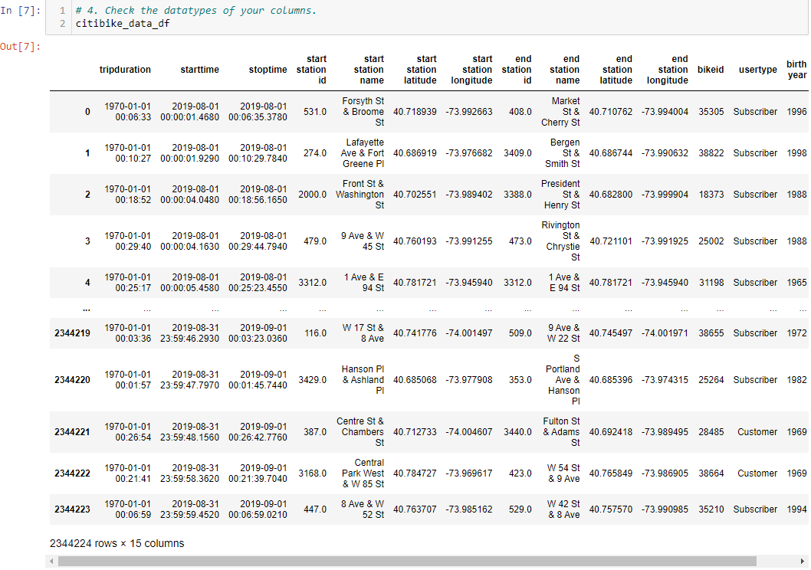
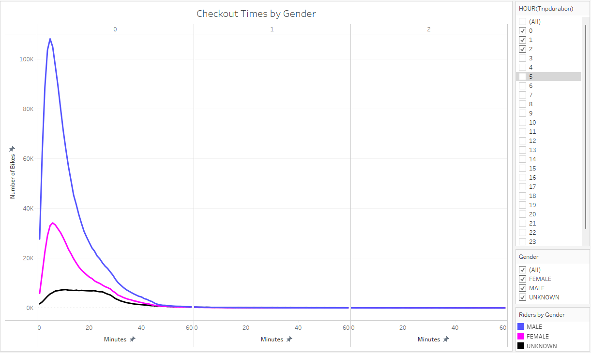
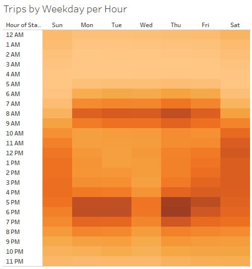
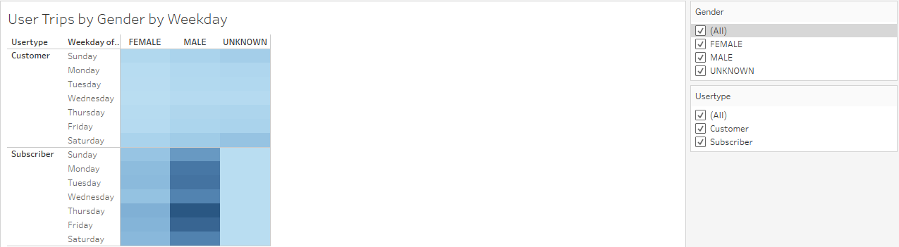
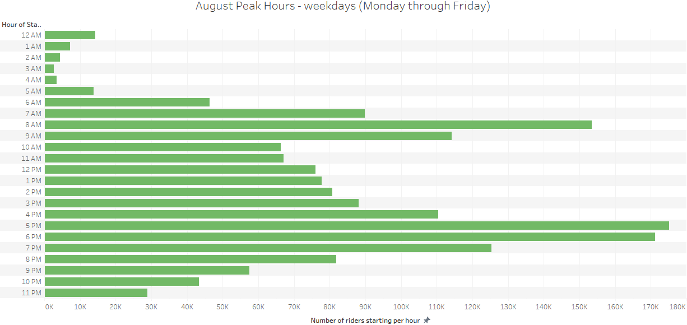
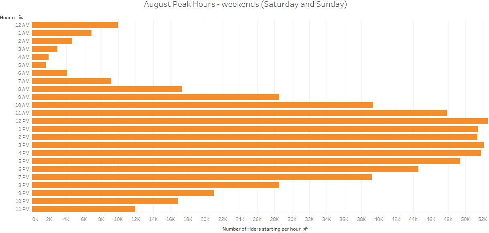

## Story and Report for the Final Presentation
[Click this link for Tableau Public](https://public.tableau.com/app/profile/ken.akerman/viz/Module14ChallengebyKenAkerman/Story?publish=yes "Link to dashboard") 
[Link to Deployed Webpage](https://highpointer.github.io/Bikesharing_CitiBike/)

The data in the "tripduration" column is converted to a datetime datatype and has the correct time format (15 pt)

The DataFrame is exported as a new file without the index column (5 pt). This file is named 201908-citibike-tripdata_new.csv

## Purpose of this analysis with key outcomes
This study analyzes patterns of riding usage of the CitiBike bike-sharing service in New York City during August 2019. It incorporates data from over 2.3 million rides to analyze bike usage per hour for each hour and for each day of the week, as well as duration of rides. Hourly bike usage and ride durations are delineated by gender of the riders (male, female, or "unknown") with further distinctions between rides by CitiBike subscribers, who pay for a subscription service and generally ride more frequently than non-subscribing customers who pay for each ride individually. 

Data is visually presented using several graphs and images to tell a story and to help the user better understand patterns and trends of CitiBike usage. This study will be incorporated into a proposed business plan to determine whether it would be feasible to start a similar bike-sharing service in Des Moines, Iowa.

Presented below are the visualizations in the [Tableau Story](https://public.tableau.com/app/profile/ken.akerman/viz/Module14ChallengebyKenAkerman/Story?publish=yes "Link to dashboard") with descriptions of the results of each visualization.

There is a line graph displaying the number of bikes checked out by duration for all users, and the graph can be filtered by the hour (10 pt)

There is a line graph displaying the number of bikes that are checked out by duration for each gender by the hour, and the graph can be filtered by the hour and gender (10 pt)

A heatmap is created showing the number of bike trips for each hour of each day of the week (10 pt)

A heatmap is created showing the number of bike trips by gender for each hour of each day of the week, and the heatmap can be filtered by gender (10 pt)
_Viz.png)

A heatmap is created showing the number of bike trips for each type of user and gender for each day of the week, and you can only filter by usertype and gender (10 pt)

## Summary of results
In addition to the five visualizations described above, two other visualizations are presented. These are ride usage numbers per hour on weekdays (Monday-Friday) and ride usage numbers on weekends (Saturday and Sunday). The Tableau Story explains these hourly variations and diffences between weekday and weekend usage patterns in greater detail.

Results show that the CitiBike bike-sharing service appears to be popular in New York City, with over 2.3 million rides in a single month. However, while this appears to be an impressive number, this does not mean that the service would be feasible in Des Moines. Such a service may be profitable in New York City, the largest and most densely populated city in the USA with over 8 million residents. On any given day, there are tens of thousands of people in New York City who are not residents but who come into the city for work, education, recreation, sightseeing, and tourism. Due to this high population density, a disproportionaly high percentage of NYC's residents don't own a motor vehicle, so getting around on bike is often a superior alternative to walking, public transit, taxis and ride sharing.

Des Moines, in contrast, has around 215,000 people within its city limits and around 700,000 in its metropolitan area. Therefore, it would be risky to extrapolate data analysis results of bike sharing across all of New York City to a considerably smaller city like Des Moines.

However, performing some additional targeted analyses of the New York City data can yield results that could be applied to Des Moines. For example, one could analyze data in a small area within New York City's five boroughs that has a lower population density than Manhattan and which differs by a lesser degree in its characteristics than Des Moines. Data analysis of a small area of New York City would be more relevant than analysis of all of New York City's data, as the entirety of New York City does not share much in common with Des Moines yet smaller neighborhoods of New York City will have more in common with Des Moines.

Another analysis to perform would be to analyze ride usage by age of the riders, using dates of birth in the database. It appears likely that bike-sharing services would be more popular among younger people, so this would indicate that such a service should be initially started in areas with higher concentrations of younger adults, such as college and university campuses. However, there may be untapped potential in areas with older population demographics, such as retirement communities. People in such communities may not generally own bikes, but most of them desire to remain active and are still able to ride bikes over relatively smooth and flat terrain, even if they find other forms of exercise like running to be more physically taxing. 
