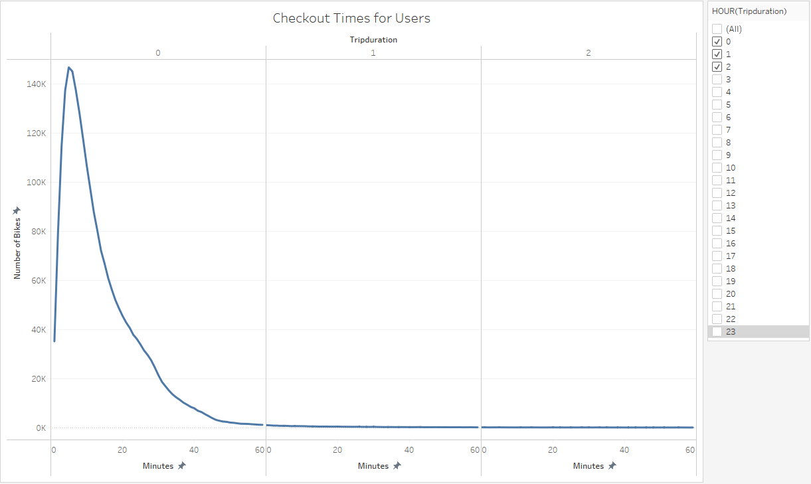

## Story and Report for the Final Presentation
[Click this link for Tableau Public](https://public.tableau.com/app/profile/ken.akerman/viz/Module14ChallengebyKenAkerman/Story?publish=yes "Link to dashboard") 
[Link to Deployed Webpage](https://highpointer.github.io/Bikesharing_CitiBike/)

The data in the "tripduration" column is converted to a datetime datatype and has the correct time format (15 pt)

The DataFrame is exported as a new file without the index column (5 pt). This file is named 201908-citibike-tripdata_new.csv

## Purpose of this analysis with key outcomes
This study analyzes patterns of riding usage of CitiBikes in New York City during August 2019. It incorporates data from over 2 million rides to analyze bike usage per hour for each hour and for each day of the week, as well as duration of rides. Hourly bike usage and ride durations are delineated by gender of the riders (male, female, or "unknown") with further distinctions between rides by CitiBike subscribers, who pay for a subscription service and generally ride more frequently than non-subscribing customers who pay for each ride individually. 

Data is visually presented using several graphs and images to tell a story and to help the user better understand patterns and trends of CitiBike usage. This study will be incorporated into a proposed business plan to determine whether it would be feasible to start a CitiBike service in Des Moines, Iowa.

Presented below are the visualizations in the [Tableau Story](https://public.tableau.com/app/profile/ken.akerman/viz/Module14ChallengebyKenAkerman/Story?publish=yes "Link to dashboard") with descriptions of the results of each visualization.

There is a line graph displaying the number of bikes checked out by duration for all users, and the graph can be filtered by the hour (10 pt)

There is a line graph displaying the number of bikes that are checked out by duration for each gender by the hour, and the graph can be filtered by the hour and gender (10 pt)

A heatmap is created showing the number of bike trips for each hour of each day of the week (10 pt)

A heatmap is created showing the number of bike trips by gender for each hour of each day of the week, and the heatmap can be filtered by gender (10 pt)
_Viz.png)

A heatmap is created showing the number of bike trips for each type of user and gender for each day of the week, and you can only filter by usertype and gender (10 pt)

## Summary of results
